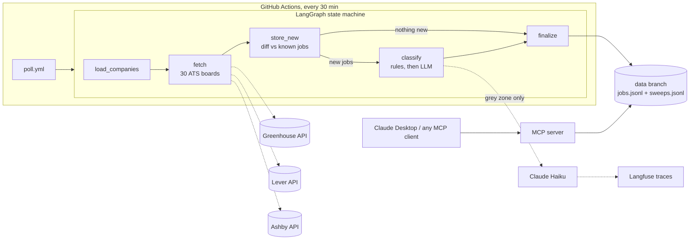

# ai-jobs-agent

An autonomous agent that catches job postings at the source, minutes after they go live, and classifies their UK visa sponsorship stance before they ever reach a job board.

Most aggregator sites index postings hours or days after companies publish them. This agent polls the applicant tracking systems directly (Greenhouse, Lever, Ashby public APIs) every 30 minutes, so the headline metric is honest and measured: **median detection latency, computed as `first_seen_at - posted_at` for every posting detected after tracking began.**

v1 is deliberately scoped to detect-classify-log. CV tailoring and notifications come later.


## Architecture



## The sponsorship classifier

Three tiers, applied in a strict order that keeps LLM spend proportional to genuine ambiguity, not job volume:

| Tier | Meaning | Decided by |
|---|---|---|
| `sponsors_explicit` | posting explicitly offers sponsorship | regex rules |
| `no_sponsorship` | posting explicitly refuses, or demands existing right to work | regex rules (checked first: refusals often contain positive-sounding fragments) |
| `silent_possible` | no stance stated; treated as a partial positive | rules (no mention at all) or LLM (mentions visas ambiguously) |

Only the grey zone reaches the LLM (Claude Haiku), which sees a windowed excerpt around the sponsorship mention rather than the whole description. Every LLM call is traced to Langfuse with model, token usage, and latency. Without an `ANTHROPIC_API_KEY`, grey-zone jobs are marked `pending` and everything else still works.

## The latency metric

- `posted_at` comes from the ATS itself (Greenhouse `first_published`, Lever `createdAt`, Ashby `publishedAt`)
- `first_seen_at` is stamped the moment a sweep first sees the posting
- The very first sweep is a baseline: those jobs are flagged `is_backfill` and excluded, otherwise the metric would be polluted by postings that predate tracking
- Median and p90 are computed over live-tracked jobs only; every sweep publishes them to its GitHub Actions run summary

With a 30-minute cron the theoretical median is ~15 minutes; the observed number appears in the Actions run summaries and via the MCP `job_stats` tool.

## State without a server

Scheduled runs commit their findings to the `data` branch as append-only JSONL (`jobs.jsonl`, `sweeps.jsonl`), which git stores as tiny line diffs. Each run rehydrates a working SQLite database from the JSONL, sweeps, and appends what it found. The run history doubles as a public, timestamped audit log of every detection.

## MCP server

Exposes the agent to Claude Desktop or any MCP client with four tools: `job_stats`, `search_jobs`, `get_job`, `run_sweep`.

```jsonc
// Claude Desktop config
{
  "mcpServers": {
    "ai-jobs-agent": {
      "command": "python",
      "args": ["-m", "jobs_agent.mcp_server"],
      "cwd": "/path/to/ai-jobs-agent"
    }
  }
}
```

Then ask things like "any new ML roles that sponsor visas since yesterday?" or "what's the median detection latency?"

## Quickstart

```bash
pip install -r requirements.txt
python -m jobs_agent.cli sweep          # one detect-classify-log cycle
python -m jobs_agent.cli stats          # metrics summary
python -m jobs_agent.cli search --query "machine learning" --tier sponsors_explicit
```

Docker:

```bash
docker build -t ai-jobs-agent .
docker run --rm -e ANTHROPIC_API_KEY ai-jobs-agent
```

## Deployment (GitHub Actions)

`poll.yml` runs every 30 minutes. Set repo secrets to enable the full pipeline:

| Secret | Purpose |
|---|---|
| `ANTHROPIC_API_KEY` | grey-zone LLM classification |
| `LANGFUSE_PUBLIC_KEY` / `LANGFUSE_SECRET_KEY` | tracing of every LLM call |

Without secrets the agent still detects, rules-classifies, and logs latency.

## The 30-company shortlist

`jobs_agent/companies.yaml`: 30 boards across Greenhouse (16), Lever (3), and Ashby (11), every slug verified live against its ATS API. Failing boards are skipped and reported per sweep, so pruning is data-driven. Edit the YAML to change coverage; nothing else needs touching.

## CI

Every push: ruff, pytest (offline, fixture-based), Docker build, then a real integration smoke test: the container polls two live ATS boards and must see jobs with zero board failures. Images publish to GHCR.

## Repo layout

```
jobs_agent/
  companies.yaml     the shortlist (verified slugs)
  ats/               greenhouse.py, lever.py, ashby.py pollers
  models.py          Job, Tier, Classification, SweepReport
  classify.py        rules + windowed LLM classifier
  tracing.py         Langfuse integration (no-op without keys)
  graph.py           LangGraph sweep state machine
  store.py           SQLite + latency metric
  persistence.py     append-only JSONL state for the data branch
  mcp_server.py      FastMCP server (4 tools)
  cli.py             sweep / stats / search
tests/               17 tests: parsers, policy, store, graph, MCP
.github/workflows/   ci.yml (lint/test/build/live smoke), poll.yml (cron)
```
